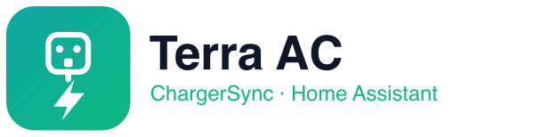

  

<h1 align="center">ABB Terra AC — ChargerSync for Home Assistant</h1>

  Control and monitor your <b>ABB Terra AC</b> EV wallbox from Home Assistant — entirely over the
  ChargeDot/ChargerSync <b>cloud</b>. No Modbus, no OCPP, no local network access to the charger required.

  
  
  
  

---

> [!WARNING]
> **Unofficial & unaffiliated.** This is a community integration built by reverse-engineering the
> ChargerSync mobile app's cloud protocol. It is **not** affiliated with, endorsed by, or supported by
> ABB or ChargeDot. The cloud API is undocumented and may change or break at any time. Use at your own risk.

## Why this exists

The ABB Terra AC is normally controlled via the ChargerSync phone app (cloud) or, locally, via Modbus/OCPP
(which need same-network access and installer/TerraConfig credentials). If your charger sits on a **different
network** and you can't get TerraConfig, neither local option works. This integration talks to the **same
cloud** the app uses, so it works from anywhere the charger has internet.

## Features

| Entity | Type | Description |
|--------|------|-------------|
| `switch.*_charging` | Switch | **Start / stop** a charging session (state reflects real charging) |
| `binary_sensor.*_connected` | Binary sensor | Cable connected at the station (connector occupied) |
| `binary_sensor.*_charging` | Binary sensor | Actively delivering power |
| `binary_sensor.*_online` | Binary sensor | Charger online (connectivity) |
| `sensor.*_power` | Sensor | Live charging power (W) |
| `sensor.*_current` | Sensor | Live charging current (A) |
| `sensor.*_voltage` | Sensor | Live voltage (V, diagnostic) |
| `sensor.*_session_energy_live` | Sensor | Energy delivered so far this session (Wh) |
| `sensor.*_session_duration_live` | Sensor | Elapsed time this session (diagnostic) |
| `sensor.*_last_session_energy` | Sensor | Energy delivered in the last session (Wh) |
| `sensor.*_last_session_cost` | Sensor | Cost of the last session |
| `sensor.*_last_session_duration` | Sensor | Duration of the last session |
| `sensor.*_last_session_end` | Sensor | When the last session ended (timestamp) |
| `sensor.*_tariff_average_price` | Sensor | Average tariff price |
| `sensor.*_connector_status` / `*_status_code` / `*_fault` | Sensor | Raw status / fault codes (diagnostic) |
| `sensor.*_rated_current` / `*_rated_power` / `*_firmware` | Sensor | Charger specs (diagnostic) |
| `update.*_firmware` | Update | Firmware update available |

All grouped under a single **device** (`ABB Terra AC`).

## Installation

### HACS (recommended)
1. HACS → ⋮ → **Custom repositories**.
2. Add `https://github.com/Dviros/ha-abb-terra-ac` with category **Integration**.
3. Search for **ABB Terra AC (ChargerSync)**, install, and restart Home Assistant.

### Manual
Copy `custom_components/abb_charger/` into your Home Assistant `config/custom_components/` directory and
restart Home Assistant.

## Configuration

1. **Settings → Devices & Services → Add Integration → "ABB Terra AC (ChargerSync)"**.
2. Enter your **ChargerSync account email & password**. The charger is auto-discovered.

> [!TIP]
> ChargeDot allows **one active session per account**, so Home Assistant and the phone app will occasionally
> log each other out. Create a **separate ChargerSync account**, **share the charger to it**, and use that
> account here — Home Assistant then never disturbs your phone app.

## Notes & limitations

- **Cloud polling** (default 60 s) for status/telemetry; start/stop commands are real-time over the cloud WebSocket.
- Live power/current/voltage and connector state come from the charger's port telemetry (`ports[].detail`).
- Energy fields are reported in **Wh**.
- Starting a session only delivers power if a vehicle is connected and requesting charge.

## Roadmap

- [x] Live **charging / connected / power** state (port telemetry)
- [ ] **Charging current** limit / load-balancing (number)
- [ ] **Free-vending**, **charge mode**, and **scheduled charging** controls
- [ ] Energy dashboard (total / cost) statistics

## Credits

Built with ❤️ for the Home Assistant community. Protocol reverse-engineered from the ChargerSync app for
personal interoperability with hardware the owner already controls.

## License

[MIT](LICENSE)
